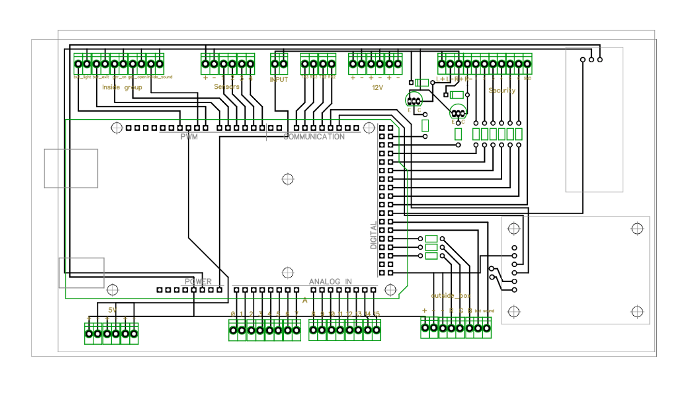
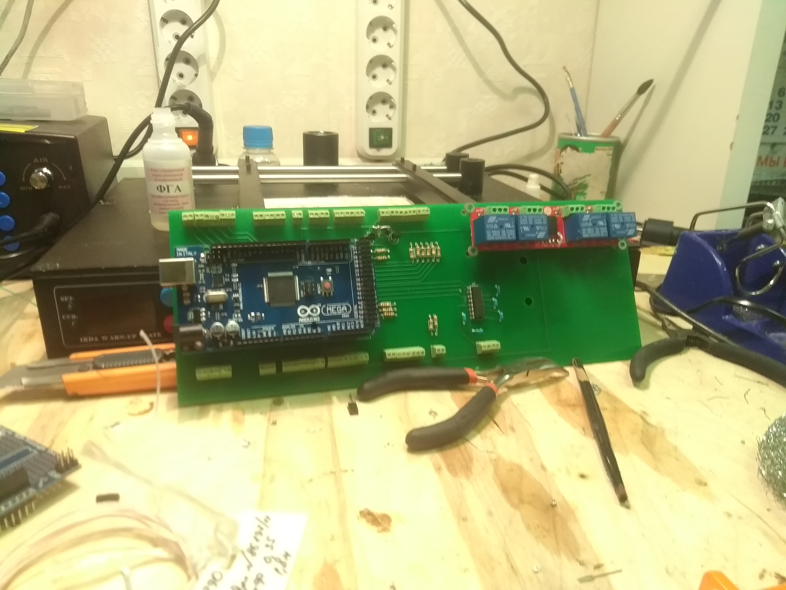
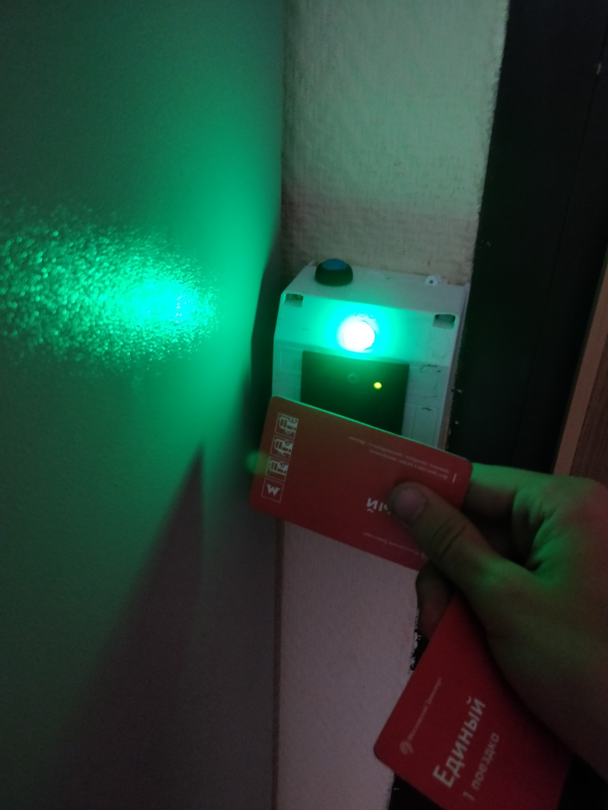
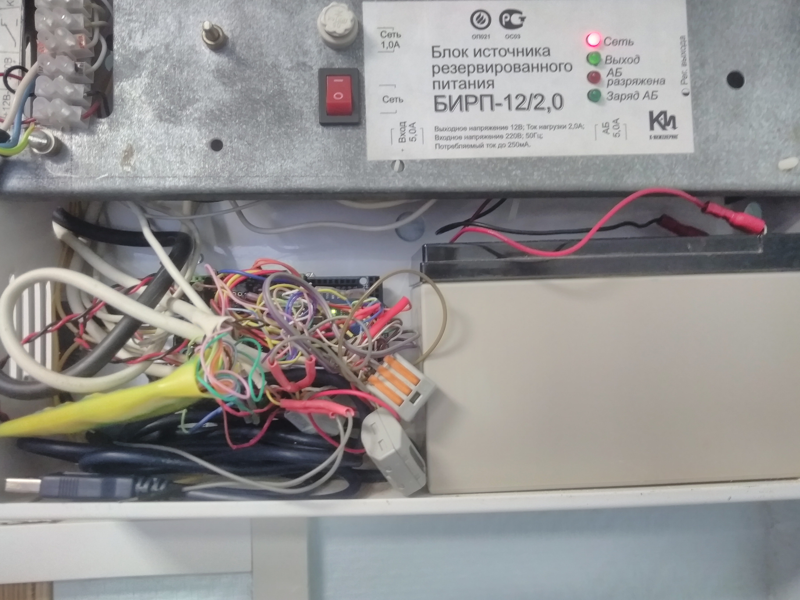
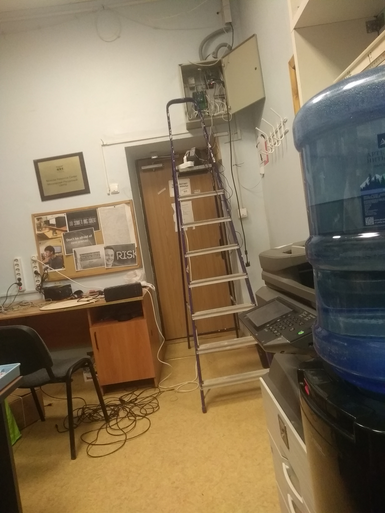

# Система контроля и управления доступом
## Проект в школе ОРТ 1540 

Состоит из нескольких компонент:

* Ардуино-контролер, использующийся для управления различными модулями
* RFID сканер карточек (коридор)
* Трехцветный светодиод для индикации состояния сканера (коридор)
* Кнопка звонка (коридор)
* Электромагнитный замок
* Датчики состояния двери (открыта/закрыта, герконы)
* Пьезоэлемент для звука звонка в дверь
* Кнопка открытия двери изнутри кабинета
* Датчики движения в кабинете
* Источник бесперебойного питания
* Реле для управления освещением
* Внешняя индикация для кабинета охраны
* Веб-сервер на Raspberry Pi, хранящий базу данных о пришедших пользователях
* Динамик для персональных приветствий

### Функционал:

* Вход в кабинет по корректным карточкам
* Аудиоприветствие вошедшего человека (например, "Добрый день, Роман"). Конструируется случайно, дополнительно учитывая время суток
* Мониторинг наличия людей в кабинете, выключение света при отсутствии людей
* Кнопка звонка, играющая мелодию из "Звездных войн"
* Отправка состояния системы на индикационную панель охранника

## Фотографии, схемы:

Одна из версий платы:

Физическая спаянная плата с Arduino и реле

Демонстрация зеленого светодиода при прикладывании нужной карты

Интеграция в кабинет до 2018 года (без собственной платы, arduino + COM-shield)

Интеграция в кабинет 2018/2019 года (а собственной платой, arduino + RS232-модуль + реле) 

Интеграция в кабинет с 2019/2020 учебного года

## Интересные документы:
* Текст проектной работы по мотивам проекта [link](МГК%20ЗАМОК%202019.pdf)
* Необходимые детали для сбора аналогичной платы [link](schemes/Список%20покупок%20для%20новой%20платы.xlsx)
* Схема соединений между блоками системы [link](schemes/locker108scheme.pdf)
